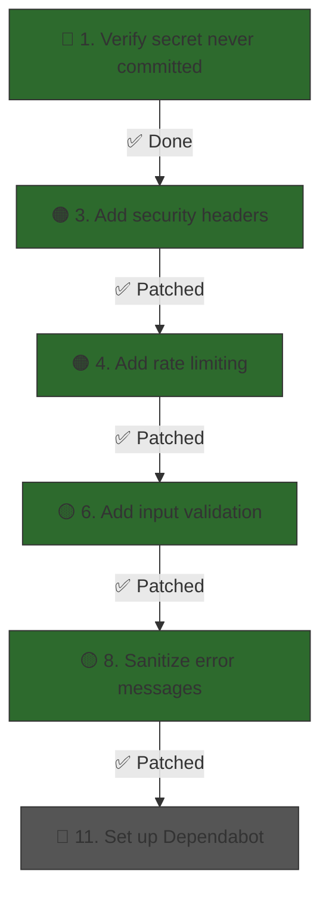

# 🔐 Security Audit — Fragrances Tracker

**Audited**: 2026-03-17  
**Stack**: Next.js 16 · Convex · Convex Auth (Google OAuth) · Bun

---

## Executive Summary

The codebase has a **solid authorization foundation** — every Convex query/mutation correctly verifies ownership using `userId`. However, there are **critical secret-management issues** and several **hardening gaps** around HTTP headers, rate limiting, input validation, and cookie configuration that should be addressed before production use.

| Severity | Count | Category |
|----------|-------|----------|
| 🔴 Critical | 2 | Secret exposure |
| 🟠 High | 3 | Missing security headers, rate limiting, cookie hardening |
| 🟡 Medium | 3 | Input validation, unbounded queries, error information leakage |
| 🔵 Low | 3 | Middleware coverage, CSRF posture, dependency hygiene |

---

## 🔴 Critical

### 1. Secret Key Committed / Exposed in `.env.local`

> [!CAUTION]
> The `CLERK_SECRET_KEY` is a **server-side secret** that must never be visible to anyone except the running server. It is currently stored in [.env.local](file:///z:/home/code/fragrances-tracker/my-app/.env.local) in plaintext.

```
CLERK_SECRET_KEY=sk_test_nL9LawNicx4myddnYqZCvMmvlY5mCXWuf3zIlplPCu
```

While `.env*` is listed in [.gitignore](file:///z:/home/code/fragrances-tracker/my-app/.gitignore#L34), you need to verify:
- ✅ Has this file **ever** been committed to git history? If so, the secret is permanently in the repository and must be **rotated immediately**.
- ✅ Is this repo public on GitHub? Even if `.env.local` is gitignored now, a past push would be catastrophic.

**Status: ✅ Verified safe** — `git log --all -p -- my-app/.env.local` returned empty; the secret has never been committed. On Vercel, secrets are stored as environment variables in the dashboard and never touch the filesystem.

### 2. Convex Deployment URL Exposed as `NEXT_PUBLIC_` Variable

The `NEXT_PUBLIC_CONVEX_URL` is intentionally public (client needs it), but the `CONVEX_DEPLOYMENT` line and inline comment expose:
- Your **team name** (`benjamin-smithynunta`)
- Your **project name** (`fragrance-app`)
- Your **exact deployment slug** (`dev:quixotic-alligator-329`)

This is a minor information disclosure, but combined with the exposed Clerk key, it gives an attacker a complete picture of your infrastructure.

**Status: ✅ Non-issue** — `CONVEX_DEPLOYMENT` is only in `.env.local` (never committed). On Vercel + Convex, deployment variables are injected automatically by the integration.

---

## 🟠 High

### 3. No Security Headers Configured — ✅ PATCHED

> [!NOTE]
> Security headers were added to [next.config.ts](file:///home/code/fragrances-tracker/my-app/next.config.ts) on 2026-03-17.

The following headers are now set on all routes via `next.config.ts`:

| Header | Value | Purpose |
|--------|-------|---------|
| `Content-Security-Policy` | Allows `'self'`, Convex cloud, Google Fonts, Google OAuth | Prevents XSS by controlling which scripts/styles can load |
| `X-Frame-Options` | `DENY` | Prevents clickjacking |
| `X-Content-Type-Options` | `nosniff` | Prevents MIME-type sniffing |
| `Referrer-Policy` | `strict-origin-when-cross-origin` | Controls how much referrer info is sent |
| `Permissions-Policy` | `camera=(), microphone=(), geolocation=()` | Disables unused browser features |

> `Strict-Transport-Security` is intentionally **omitted** — Vercel enforces HTTPS and sets HSTS automatically on all deployments.

If you add new external resources (e.g. an analytics script, a CDN for images), you'll need to update the CSP `connect-src` / `script-src` / `img-src` directives in `next.config.ts`.

### 4. No Rate Limiting on Mutations — ✅ PATCHED

> [!NOTE]
> Rate limiting was added on 2026-03-17 using the `@convex-dev/rate-limiter` component.

Per-user rate limits are now applied to every write mutation via the centralized config in [rateLimits.ts](file:///home/code/fragrances-tracker/my-app/convex/rateLimits.ts):

| Mutation | Strategy | Rate | Burst capacity |
|----------|----------|------|----------------|
| `addBottle` | Token bucket | 10/min | 5 |
| `updateBottle` | Token bucket | 20/min | 5 |
| `deleteBottle` | Token bucket | 10/min | 3 |
| `addWearLog` | Token bucket | 20/min | 5 |
| `updateWearLog` | Token bucket | 20/min | 5 |
| `deleteWearLog` | Token bucket | 20/min | 5 |

When a limit is exceeded, Convex automatically returns a `ConvexError` with a `retryAfter` value.

#### How to configure the rate limiter

The rate limiter is set up across three files:

1. **[convex/convex.config.ts](file:///home/code/fragrances-tracker/my-app/convex/convex.config.ts)** — Registers the `@convex-dev/rate-limiter` component with the Convex app. This is one-time setup; you shouldn't need to touch it again.

2. **[convex/rateLimits.ts](file:///home/code/fragrances-tracker/my-app/convex/rateLimits.ts)** — Central config where all limits are defined. To adjust a limit, change the values here:

   ```typescript
   import { RateLimiter, MINUTE, HOUR } from "@convex-dev/rate-limiter";
   import { components } from "./_generated/api";

   export const rateLimiter = new RateLimiter(components.rateLimiter, {
     // Example: allow 30 wear logs per minute with a burst of 10
     addWearLog: { kind: "token bucket", rate: 30, period: MINUTE, capacity: 10 },
   });
   ```

   **Parameters:**
   - `kind` — `"token bucket"` (smooth, allows burst) or `"fixed window"` (all-at-once every period)
   - `rate` — tokens added per `period`
   - `period` — time window in ms (use `MINUTE`, `HOUR` helpers from the package)
   - `capacity` — max burst size (defaults to `rate` if omitted)

3. **Mutation files** ([bottles.ts](file:///home/code/fragrances-tracker/my-app/convex/bottles.ts), [wearLogs.ts](file:///home/code/fragrances-tracker/my-app/convex/wearLogs.ts)) — Each mutation calls the limiter:

   ```typescript
   await rateLimiter.limit(ctx, "addBottle", { key: userId, throws: true });
   ```

   - `key: userId` makes the limit per-user
   - `throws: true` auto-throws a `ConvexError` when exceeded (client gets `{ kind, name, retryAfter }`)
   - Without `throws`, it returns `{ ok: boolean, retryAfter: number }` for manual handling

After changing limits, re-deploy with `npx convex dev` (development) or `npx convex deploy` (production).

### 5. Cookie Configuration Missing `secure` and `sameSite`

> [!NOTE]
> **Status: ✅ Non-issue** — `@convex-dev/auth` already sets `secure: true` and `sameSite: "lax"` as defaults in production environments. Locally, `secure: false` is correct so cookies work over `http://localhost`.

In [proxy.ts](file:///home/code/fragrances-tracker/my-app/src/proxy.ts#L23-L26), the cookie config only sets `maxAge`:

```typescript
cookieConfig: {
  maxAge: 60 * 60 * 24 * 30,  // 30 days
},
```

The `@convex-dev/auth` library handles `secure` and `sameSite` defaults based on the environment. You can verify this by inspecting the `Set-Cookie` response header in your browser DevTools — you should see `Secure; SameSite=Lax` on the production deployment.

---

## 🟡 Medium

### 6. Insufficient Input Validation / Sanitization — ✅ PATCHED

> [!NOTE]
> Server-side validation was added on 2026-03-17 in [bottles.ts](file:///home/code/fragrances-tracker/my-app/convex/bottles.ts) and [wearLogs.ts](file:///home/code/fragrances-tracker/my-app/convex/wearLogs.ts).

The following server-side limits are now enforced (these cannot be bypassed like HTML `min`/`max` attributes):

| Field | Limit | Location |
|-------|-------|----------|
| `name` (bottle) | 200 characters | `bottles.ts` — `assertValidBottleInput()` |
| `brand` | 200 characters | `bottles.ts` — `assertValidBottleInput()` |
| `comments` (bottle) | 2,000 characters | `bottles.ts` — `assertValidBottleInput()` |
| `tags` | Max 20 tags, 50 chars each | `bottles.ts` — `assertValidBottleInput()` |
| `sizeMl` | Max 10,000 mL | `bottles.ts` — `assertValidBottleInput()` |
| `sprays` | Max 100 (also ≥ 1, integer) | `wearLogs.ts` — `assertValidSprays()` |
| `comment` (wear log) | 2,000 characters | `wearLogs.ts` — inline checks |
| `context` (wear log) | 200 characters | `wearLogs.ts` — inline checks |

Constants are defined at the top of each file so they're easy to find and adjust.

### 7. Unbounded `.collect()` Queries

Several queries use `.collect()` without a `.take(limit)`, meaning they load **all** matching documents into memory:

| Query | File | Risk |
|-------|------|------|
| `listBottles` | [bottles.ts:15-19](file:///home/code/fragrances-tracker/my-app/convex/bottles.ts#L15-L19) | All user's bottles |
| `listBottleStats` | [wearLogs.ts:15-18](file:///home/code/fragrances-tracker/my-app/convex/wearLogs.ts#L15-L18) | All user's wear logs |
| `listWearLogs` | [wearLogs.ts:41-45](file:///home/code/fragrances-tracker/my-app/convex/wearLogs.ts#L41-L45) | All user's wear logs |
| `listWearLogsByBottle` | [wearLogs.ts:62-66](file:///home/code/fragrances-tracker/my-app/convex/wearLogs.ts#L62-L66) | All logs for a bottle |
| `deleteBottle` (cascade) | [bottles.ts:123-126](file:///home/code/fragrances-tracker/my-app/convex/bottles.ts#L123-L126) | All logs for a bottle |

For a personal tracker with moderate use this is fine, but if a user accumulates thousands of logs, these queries will hit Convex's execution time/memory limits and could affect performance.

**Status: 🔵 Deferred** — For a personal fragrance tracker the data volumes stay low. Pagination would add significant UI complexity without matching benefit at this scale. Revisit if the app grows to support many users.

### 8. Error Messages May Leak Information — ✅ PATCHED

> [!NOTE]
> Error sanitization was added on 2026-03-17 in [sign-in-screen.tsx](file:///home/code/fragrances-tracker/my-app/src/components/sign-in-screen.tsx).

Previously, raw `error.message` was displayed to the user, which could leak internal details from the auth library or Convex backend. Now:

```typescript
catch (error) {
  console.error("Google sign-in failed:", error);
  setErrorMessage("Unable to start Google sign-in. Please try again.");
}
```

- The raw error is logged to the console (available in DevTools for debugging)
- The user sees a fixed, generic message regardless of the actual error

---

## 🔵 Low

### 9. Middleware Route Matcher May Miss API Routes

The middleware matcher in [proxy.ts](file:///home/code/fragrances-tracker/my-app/src/proxy.ts#L29-L31):

```typescript
matcher: ["/((?!.*\\..*|_next).*)", "/", "/(api|trpc)(.*)"],
```

This is fairly standard, but verify that:
- All API routes are actually protected
- Static assets are correctly excluded
- The catch-all doesn't inadvertently skip new routes

**Status: ✅ Fine as-is** — This is the standard Next.js middleware pattern. It correctly protects pages while excluding static assets and `_next/`.

### 10. CSRF Protection Relies Entirely on Convex Auth

The app has **no custom CSRF token implementation**. It relies on:
- Convex Auth's built-in protections
- The `sameSite` cookie attribute (which is set by `@convex-dev/auth` in production — see finding #5)

**Status: ✅ Fine as-is** — With OAuth (no form-based passwords) + `sameSite: "lax"` cookies, CSRF risk is negligible.

### 11. No Dependency Audit / Lock File Hygiene

There's no indication of automated dependency vulnerability scanning (e.g., `npm audit`, Dependabot, Snyk).

**Remediation:**
- Enable GitHub Dependabot alerts on the repository
- Run `bun audit` or `npm audit` periodically
- Consider pinning exact dependency versions instead of ranges (e.g., `^1.32.0`)

---

## ✅ Things Done Well

| Area | Assessment |
|------|------------|
| **Row-level authorization** | ✅ Every query and mutation correctly checks `userId` ownership before returning or modifying data |
| **Ownership helper pattern** | ✅ Centralized `getUserId()` / `getOptionalUserId()` in [helpers.ts](file:///home/code/fragrances-tracker/my-app/convex/helpers.ts) reduces auth bypass risk |
| **No `dangerouslySetInnerHTML`** | ✅ No raw HTML injection anywhere in the frontend |
| **No `eval()` or dynamic code execution** | ✅ Clean |
| **Server-side auth redirects** | ✅ Both [page.tsx](file:///home/code/fragrances-tracker/my-app/src/app/page.tsx) and [signin/page.tsx](file:///home/code/fragrances-tracker/my-app/src/app/signin/page.tsx) check auth server-side |
| **Convex schema validation** | ✅ Strong typing with `v` validators prevents type-based injection |
| **OAuth delegation** | ✅ No password handling — authentication is fully delegated to Google via Convex Auth |
| **Cascade deletes** | ✅ Orphaned wear logs are cleaned up when a bottle is deleted |
| **`.gitignore` coverage** | ✅ `.env*` files are properly gitignored |
| **Server-side input bounds** | ✅ All string fields and numeric values have max-length/max-value checks (patched 2026-03-17) |
| **Rate limiting** | ✅ All write mutations are rate-limited per-user via `@convex-dev/rate-limiter` (patched 2026-03-17) |
| **Security headers** | ✅ CSP, X-Frame-Options, X-Content-Type-Options, Referrer-Policy, Permissions-Policy all configured (patched 2026-03-17) |

---

## Priority Action Plan



> [!IMPORTANT]
> **Remaining items**: Only #11 (Dependabot) and #7 (pagination) remain open. #11 is a GitHub settings toggle — enable Dependabot alerts on your repo. #7 is deferred as unnecessary at current scale.
